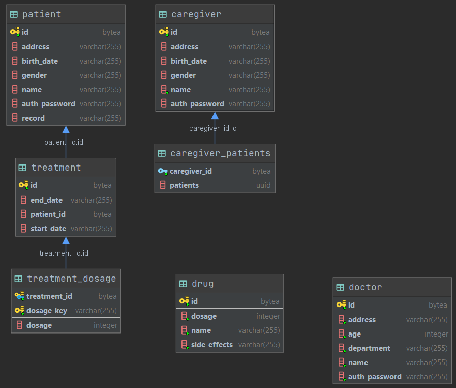
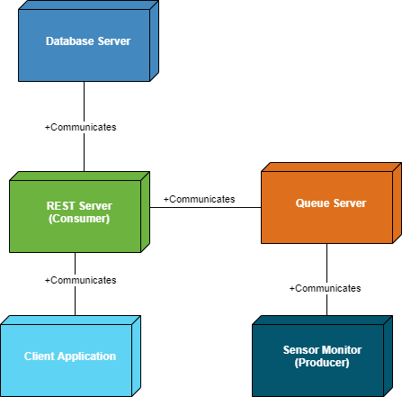
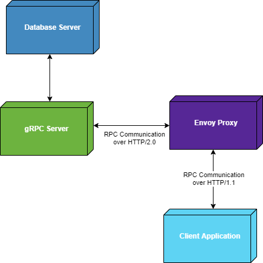

# Medical Monitoring Platform
## Spring Server Application

### Phase 1 - Online Medication Platform built using RESTful services and a JS client application

 - PostgreSQL DB
 - Spring Java backend
 - React frontend
 - all deployed on Heroku 
 
 

#### Database Model - extracted from IntelliJ

### Phase 2 - Sensor Monitoring and Notifications using MOM and WebSockets

- Added RabbitMQ message queue for asynchronous notifications
- sensor data produced by mock application and pushed on queue
- notifications sent to frontend via a websocket

### Phase 3 - gRPC-based medication notification service

- interval-based medication service that alerts patient of when they need to take medication
- the medication plan of a patient is requested from the server and sent to the client by gRPC

